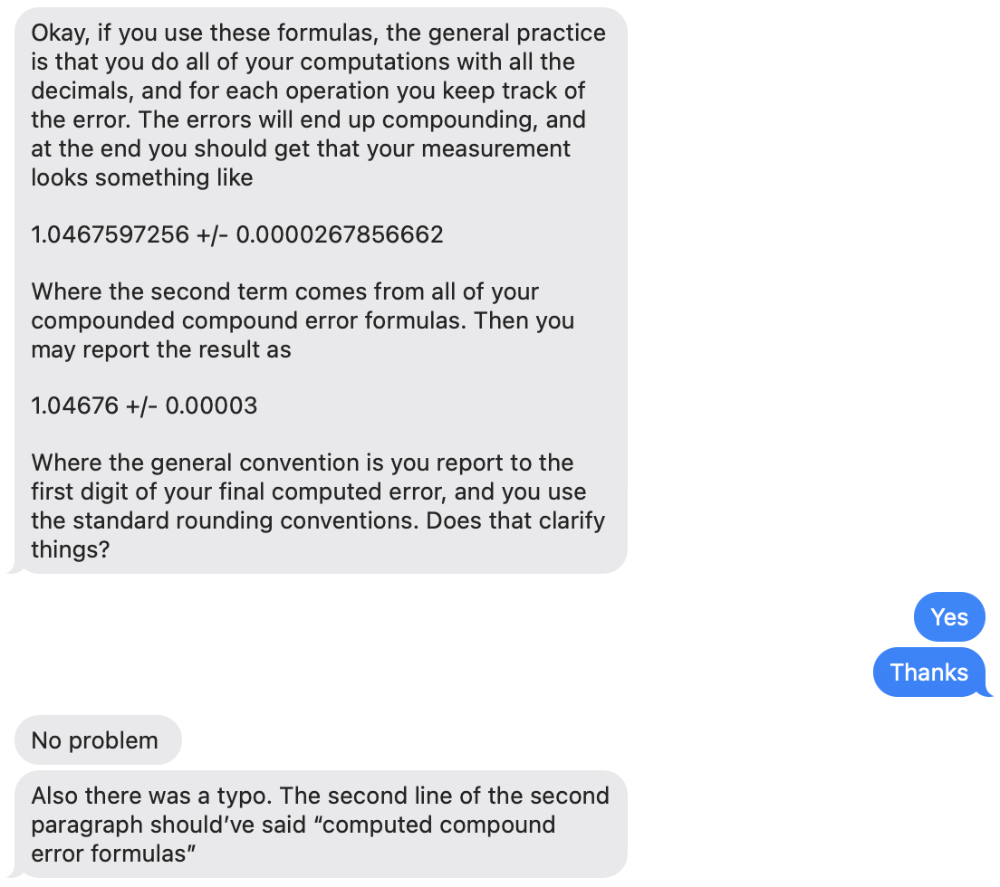
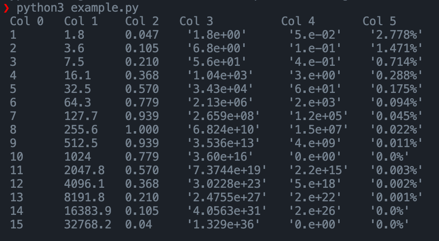

<style>
span {
  color: red;
  }
</style>

# Bugless Errors

<span style="color:red">Warning: This is not well tested and you should be carefull with trusting my program to much. If there are any errors, please create an issue or email `brandon.e.feder@gmail.com`.</span>

## Introcution
This is a library I created in order to make doing simple operations with measured data easier. It's main purporse it so provide a structure that allows for menipulating numbers with proper significant figures and error propogation. However, it also provides a few utilities to make dealing with real data easier.

<span style="color:green">I would suggest you read through this documentation breifely but also look at `example.py` which may be more useful to som people.</span>

I also know that this is some really shitty documentation. I probubly wont fix that.

## Installtaion (For lack of a better word)
Copy `errorNums.py`, then paste `errorNums.py`. Include it with somthing like `from errorNums import *`.

## `AvgErrorFloat` class
The `AvgErrorFloat` class is the bulck of the program and is the class that does all the arithmetic on the measurements and their errors. 

The class uses the following convention. Please read:


Because of this, the result may be very slightly different then if you were rounding after every multiplication, addition, subtraction, etc.

<span style="color:orange">Note: Computers are not perfect and rounding errors happen ALL THE TIME. For example, if for some reason you expect something to be exactly 0, it may instead be something like 0.0000000...1. Be aware of this. This rounding error should not effect the result of any computation in any meaningful way as long as the numbers being stored comforably fit in a 64-bit floating point format.</span>

### Constructor
Function decleration:
```
AvgErrFloat.__init__(val, err=0, nsf=float('inf'))
```

- `val` is the actual value. It may be a `float` or `int`.
- `err` is the error. It may be a `float` or `int`. This argument is optional and if left blank, defaults to `0` implying no error.
- `nsf` is the number of significant digits. It must be a non-negative `int` or a `float` with the value `inf`. If optional, it defaults to `inf` implieng infinite significant digits.

### Operations
`AvgErrorFloat` provides a number of operations that can be performed between `float`s/`int`s and `AvgErrorFloat`s. When a `float` or an `int` is passed, it is assumed to have infinite precision and `0` error.

In the following, `A` and `B` may be either a `AvgErrorFloat`, `float`, or `int`. `m` must be a `float` or an `int`.

All return an `AvgErrorFloat`

```
@staticmethod
add(A, B)

@staticmethod
sub(A, B)

@staticmethod
mul(A, B)

@staticmethod
div(A, B)

@staticmethod
pow(A, m)

@staticmethod
sqrt(A)
```

### Overloaded operators and functions
A `AvgErrorFloat` can be converted to it's string representation using python's `str()` function.

The following operations can be used. They literally just send their arguments to the functions in the **Operations** section:

`+`, `-`, `*`, `/`, `**`

In case you are not familiar with python, `**` usually represents exponentiation rather than `^` which represents the bitwise-xor.

### Normal Member Access
The unformatted error is stored in `err`, the number of significant figures in `nsf`, and the actual value in `val`. For example, if I have a `AvgErrorFloat`, I can access these values like this:

```
X = AvgErrorFloat(9.8, 0.1, 2)
print("The Error: ", X.err)
print("The Value: ", X.val)
print("The NSFs: ", X.nsf)

# Output:
#   The Error: 0.1
#   The Value: 9.8
#   The NSFs: 2
```

### Formatted Member Access
The formatted member access is essentially getting whats in the **Normal Member Access** section as a string that's formatted according to the number of significant figures, proper rounding, etc.

There are three functions for doing this ( four but the last is for interface consistency ). All these functions return a string. They are the following:

```
def getValue(self, useSciNot=True)

def getError(self, useSciNot=True)

def getPercentError(self, ndig)
```

The `getValue` function returns `val` as a string always in scientific notation if `useSciNot` is `True`, or either scientific notation or normal notation depending on what makes the most sense. `useSciNot` is optional and defaults to `True`. The result is correectly rounded.

The `getError` function returns `err` as a string always in scientific notation if `useSciNot` is `True`, or either scientific notation or normal notation depending on what makes the most sense. `useSciNot` is optional and defaults to `True`. The result is correctly rounded.

The `getPercentError` function returns the error divided by the actual value rounded to `ndig`s AFTER THE DECIMAL.

<span style="color:orange">Note: these strings should be rounded correctly, but dont expect to be able to convert them to a float, perform arithmetic, then convert them back and it still be rounded correctly. IT DOES NOT WORK LIKE THAT. These functions should only be called when there result will not be used in any more computations.</span>

## Other Useful Stuff
### What is CSV format?
CSV is a text-based format is used to store a table where there are equal rows and coloumns. Each row is seperated by a newline and each element in a coloumn is seperated by a comma. For example, the table

| Name | Grade |
| ----------- | ----------- |
| Broc Olli | 97%       |
| Anita Bath | 94%        |
| Sal Ami | 95% 

may be rerpesented as 
```
Name, Gender
Broc Olli, 97%
Anita Bath, 94%
Sal Ami, 95%
```

A CSV file, a file with the `.csv` extension, is a file that contains text in the CSV format.

### The `printTabular` function

There are some other useful functions that this file provides namely `printTabular` and `applyFuncToCSV`. 

The `printTabular` is really just a helper to `applyFuncToCSV` that maybe you sill find useful. Essentially, it takes a string formatted like a CSV file and prints it in a bumch of coloumns like this:



### The `applyFuncToCSV` function

The `applyFuncToCSV` function is the main utility that I expect you will find useful. Here is the function decleration

```
def applyFuncToCSV(func, finPath, foutPath=None, foutAppendToIn=False)
```

`func` is a function that should have the following decleration:

```
def func(args)
```

The `finPath` argument takes a string where a `.csv` file is located. 

The `foutPath` takes a string or `None`. It is optional and is by default `None`. If it is not `None`, then it should be a path to where the output of the `applyFuncToCSV` function should go. If there does not already exist a file at `foutPath`, then it will be created. If `foutPath` is `None`, then the data will be printed to the console using the `printTabular` function.

The `foutAppendToIn` argument is optional and defaults to `False`. If it is `True`, the output of `func` will be appended to the original data. If it is `False`, then just the output of `func` will be used.

I know that this is probubly confuisng, so please look at `example.py` for more information. 
